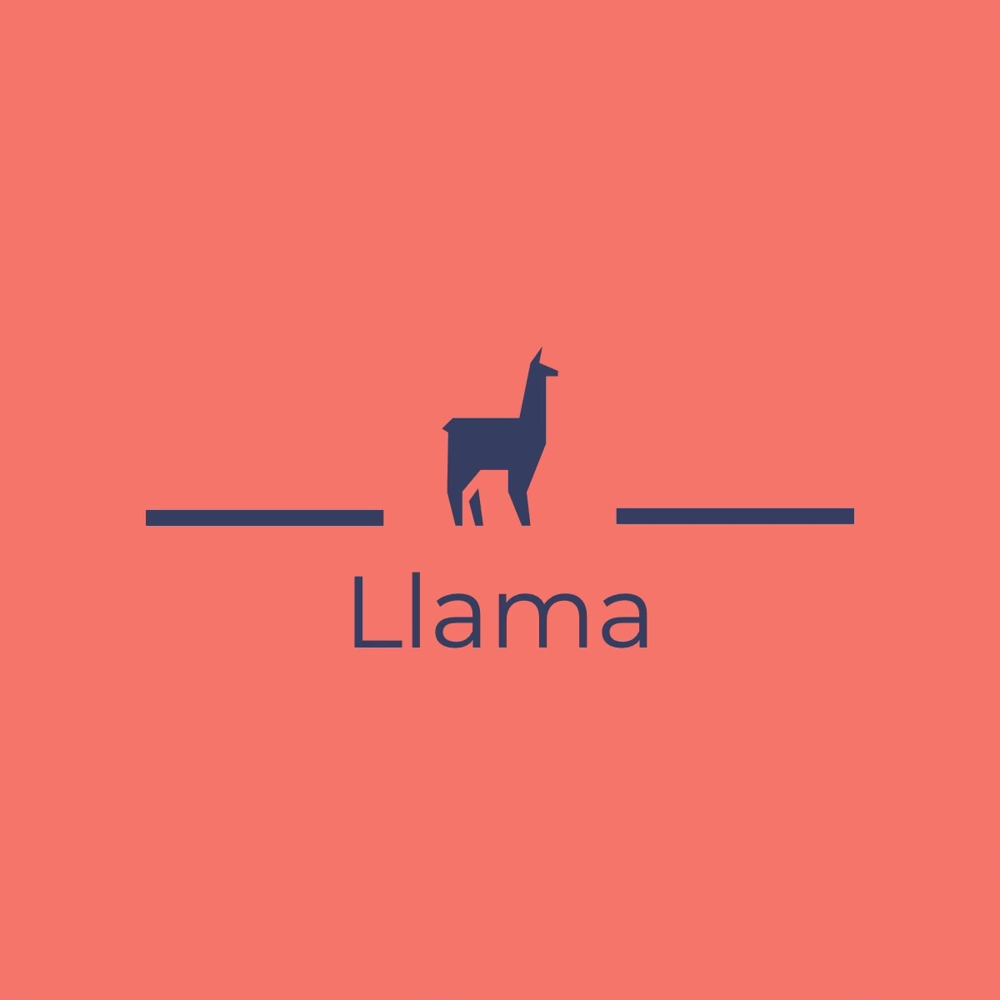

#
Authors: Andrew Kenn, Michael Bollinger, Kasey Fung, Isabel Macgill, Alpha Kaba

Llama is a programming language that helps serve as an intermediate language between Python and Java. With type declarations and essential computational functions sensitive to their arguments’ types, this language can help new programmers understand data types and how to use basic operations with basic types. Llama will require users to utilize appropriate functions for types, similar to Ocaml’s type control for basic computational operations. This language will have an imperative paradigm, be statically and strongly typed, have static scoping and strict evaluation order, and require explicit type-casting.

# Running Tests

## 1. Building Native Files
    Run 'make' or Run './testingllama.sh' both commands will build the native files for test1.ml, test2.ml, and llama.ml. In the case of running './testingllama.sh' the usage for the testing shell will also be printed.

## 2. Running The Testing Shell
    The testing shell comes with options to run the llama native frontend and llvm backend on .ll(llamalang) source files.
    Interactive mode gives the user the ability to test as many individual files as desired before exiting.
    The Testing shell will print to the terminal the print out of the abstract syntax tree following parsing.
    It will also print out the semantically check abstract syntax tree, followed by the Ir code generated from the llvm.
    Finally it will print out the executed output of the ircode and will print out the expected output.

    usage: ./testingllama [options] [<file.ll>]          
                                                      
    options:                                             
    -a | --all tests all test files                    
    -f | --file test a specific file                   
    -h | --help prints usage                           
    -i | --interactive enters interactive mode         
    --prim tests all files in test/primitives directory
    --cont tests all files in test/control    directory
    --func tests all files in test/functions  directory
    --fail tests all files in test/failures   directory
    --clean removes all .err .output .llama files from test/ out/ directories 

## 3. Creating your own Test Cases
    If you desire to produce your own testing please provide a .expected file in the same directory with the desired file to
    be tested.

## 4. Cleaning test output files
    By running either './testingllama.sh' or 'make testclean' all .err or .output and .llama files will be cleaned from the directory.

# Credits

### Micro C (Professor Edward’s): COMS W4115 Programming Languages and Translators ** under Objective Caml Resources called “OCaml source and test cases for the MicroC language, which generates LLVM IR” **
### Micro C (Professor Gu’s): COMS W4115 Programming Languages and Translators **under TENTATIVE Syllabus **
### Viper: COMS W4115 Programming Languages and Translators ** student project by Mustafa Eyceoz, Trey Gilliland, Thomas Kaufman-Gomez, Raghav Mecheri, and Matthew Ottomano Jr. ** 
### PyThon: COMS W4115 Programming Languages and Translators ** student project by Gabriel Clinger, George DiNicola, Daniel Hanoch, and Cameron Miller **  

